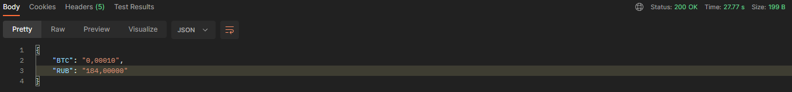

# Приложение - биржа
## Обзор
Сервис является RESTfull API приложением для проведения торгов криптовалютами.
Согласно ТЗ реализованы минимальные требования и часть дополнительных заданий.

---
### Сервис реализует (обязательные требования):

- создан при помощи Spring Boot;
- возвращает все данные в формате Json;
- используется 2 роли: Пользователь и Администратор(далее - User и Admin)

### Сервис позволяет произвести действия (минимальные требования):
 
- Всем
  - просмотр актуальных курсов валют
- Пользователю
  - регистрация;
  - пополнение кошелька;
  - обмен валют по установленному курсу
  - просмотр баланса своего кошелька;
  - вывод денег с биржи;
- Администратору
  - изменить курс валют
  - посмотреть общую сумму указанной валюты на всех пользовательских счетах
  - посмотреть количество операций за указанный период

### Сервис реализует дополнительные требования:

- подключена база данных PostgreSQL

---
### Используемые технологии

- Java 17
- Spring Boot
- Maven
- Lombok
- PostgreSQL
- Apache Commons (Codec)

---
## Запуск

- Клонировать к себе репозиторий, выполнив команду:

'https://github.com/username/SequenceService'

- заполнить файл:

'src/main/resources/application.properties':
Все строки формата <something> заменить на ваши данные

- Перейти в корневую папку проекта и прописать команду:

'mvn spring-boot:run'

---
## Endpoints

### All (общие)

- #### Возвращает актуальные курсы валют

    'GET /curse'

#### Параметры:

secret_key - секретный ключ пользователя (автоматически генерируется при регистрации)

currency   - сокращенное название валюты (пример биткоин -> BTC, DogeCoin -> DOGE)

#### Ответ:

    {
        "<названиеВалюты>": "<количество>",
        "<названиеВалюты>": "<количество>",
            ...
        "<названиеВалюты>": "<количество>",
    }

#### Пример запроса

#### Пример ответа

---
### USER (пользователи)

- #### Регистрация пользователя

    'POST /sign-up'

#### Параметры:

username - имя пользователя

email    - почта пользователя

#### Ответ:

    {
        "secret_key": "key"
    }

#### Пример запроса

#### Пример ответа

---
- #### Пополнение кошелька

    POST /balance/top-up

#### Параметры

secret_key - секретный ключ пользователя (автоматически генерируется при регистрации)

RUB_wallet - количество валюты для пополнения  

#### Ответ

    {
        "RUB_wallet": "count"
    }

#### Пример запроса

#### Пример ответа

---
- #### Обмен валют по установленному курсу

    POST balance/exchange

#### Параметры

secret_key    - секретный ключ пользователя (автоматически генерируется при регистрации)

currency_from - изначальная валюта

currency_to   - новая валюта

amount        - количество валюты для обмена

#### Ответ

    {
	    "currency_from": "<названиеВалюты>",
        "currency_to": "<названиеВалюты>",
	    "amount_from": "<количество>",
        "amount_to": "<количество>"
    }

#### Пример запроса

#### Пример ответа

---
- #### Просмотр баланса своего кошелька

    GET /balance

#### Параметры

secret_key - секретный ключ пользователя (автоматически генерируется при регистрации)

#### Ответ

    {
        "<названиеВалюты>": "<количество>",
        "<названиеВалюты>": "<количество>",
        ...
        "<названиеВалюты>": "<количество>"
    }

#### Пример запроса

#### Пример ответа

---
- #### Вывод средств

    POST /withdraw

#### Параметры

secret_key                  - секретный ключ пользователя (автоматически генерируется при регистрации)

currency                    - RUB (если wallet, то валюта в которой происходит вывод)

count                       - количество денег, которые необходимо вывести

credit_card                 - номер карты, на которую производится вывод средств

wallet (вместо credit_card) - ключ кошелька, на который производится вывод средств

#### Ответ

    {
	    "<названиеВалюты>_wallet": "<количество>"
    }

#### Пример запроса (credit_card)

#### Пример запроса (wallet)

#### Пример ответа 

---
### ADMIN (администратор) 

- #### Изменить курс валют

    POST /curse/change

#### Параметры

secret_key  - секретный ключ пользователя (автоматически генерируется при регистрации)

base_currency - валюта, курс которой необходимо изменить

currencyName (может быть несколько) - валюта и её новый курс к base_currency

#### Ответ

    {
        "<названиеВалюты>": "<количество>",
        "<названиеВалюты>": "<количество>",
        ...
        "<названиеВалюты>": "<количество>"
    }

#### Пример запроса

#### Пример ответа

---
- #### Посмотреть общую сумму на всех пользовательских счетах для указанной валюты

    GET /wallets/sum

#### Параметры

secret_key - секретный ключ пользователя (автоматически генерируется при регистрации)

currency   - валюта, общую сумму которой необходимо найти 

#### Ответ

    {
        "<названиеВалюты>": "<сумма>"
    }

#### Пример запроса

#### Пример ответа

---
- #### Посмотреть количество операций, которые были проведены за указанный период

    GET /transactions/count

#### Параметры

secret_key - секретный ключ пользователя (автоматически генерируется при регистрации)

date_from  - дата начала периода

date_to    - дата окончания периода

#### Ответ

    {
        "transaction_count": "<кол-во операций>"
    }

#### Пример запроса

#### Пример ответа

